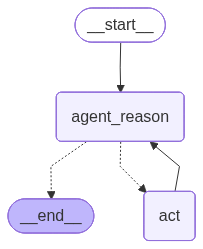

# ReAct Agent with Function Calling — LangGraph + Ollama

> **Course Project** — Build a locally-running AI agent that reasons, calls tools, and loops until it reaches a final answer.



---

## What You Will Learn

| # | Concept | File |
|---|---------|------|
| 1 | What is a ReAct agent and how does it reason? | Theory below |
| 2 | How to define tools and bind them to a local LLM | `react.py` |
| 3 | How to write LangGraph nodes (Think & Act steps) | `nodes.py` |
| 4 | How to wire nodes into a stateful graph with conditional edges | `main.py` |

---

## Part 1 — Theory: The ReAct Pattern

**ReAct = Reason + Act**, introduced in the 2022 paper *"ReAct: Synergizing Reasoning and Acting in Language Models"*.

The core idea: instead of answering in one shot, the agent alternates between two steps in a loop:

```
User Question
      │
      ▼
 ┌──────────┐   tool_call?   ┌──────────┐
 │  REASON  │ ─────── YES ──▶│   ACT    │
 │  (LLM)   │               │  (Tool)  │
 └──────────┘               └────┬─────┘
      │                          │ result fed back
      │ tool_call? NO            └──────────────▶ (loop)
      ▼
  Final Answer
```

**Why this matters:**
- A plain LLM cannot look up today's weather — its knowledge is frozen at training time.
- With ReAct, the model can *decide* to call a search tool, get live data, and incorporate it into the answer.
- The loop continues until the model is confident enough to answer without calling any more tools.

---

## Part 2 — Theory: LangGraph Concepts

LangGraph turns the ReAct loop into a **directed graph**:

| Concept | What it means |
|---------|---------------|
| **Node** | A Python function that receives state, does work, returns updated state |
| **Edge** | A fixed connection between two nodes |
| **Conditional Edge** | A connection whose target is decided at runtime by a routing function |
| **State (`MessagesState`)** | A shared list of messages passed between every node |
| **END** | A sentinel value that terminates graph execution |

The state object (`MessagesState`) is the memory of the agent — every message (human, AI, tool result) is appended to it as the graph runs.

---

## Part 3 — Theory: Tool Calling

When an LLM is given tools, it can respond in two ways:

1. **Plain text** — a normal answer, no tool needed.
2. **Tool call** — a structured JSON object: `{ "name": "triple", "args": { "num": 25 } }`.

The graph intercepts case 2, runs the actual Python function, appends the result as a `ToolMessage`, and calls the LLM again. This cycle repeats until case 1 happens.

---

## Part 4 — Code Walkthrough

### `react.py` — LLM + Tools

This is where you define **what tools exist** and **which model to use**.

```
react.py
  ├── @tool triple()          ← custom Python function exposed as a tool
  ├── TavilySearch            ← pre-built web search tool
  ├── tools = [...]           ← registry passed to both LLM and ToolNode
  ├── USE_HUGGINGFACE = True  ← switch between HF and Ollama backends
  └── llm = ChatHuggingFace(...).bind_tools(tools)   ← or ChatOllama
```

Key insight: `.bind_tools(tools)` sends the tool schemas to the model on every call so it always knows what functions are available.

**Switching backends** — edit one line in [react.py](react.py):
```python
USE_HUGGINGFACE = True   # HuggingFace free API
USE_HUGGINGFACE = False  # local Ollama
```

---

### `nodes.py` — Graph Nodes

Defines the two steps of the ReAct loop as LangGraph nodes.

```
nodes.py
  ├── run_agent_reasoning()   ← NODE 1: calls LLM, returns AIMessage
  │     prepends system prompt + full message history
  │     LLM either emits tool_calls OR a final answer
  │
  └── tool_node = ToolNode()  ← NODE 2: reads tool_calls, runs them,
                                         returns ToolMessage(s)
```

---

### `main.py` — Graph Assembly

Wires the nodes together into a runnable graph.

```
main.py
  ├── StateGraph(MessagesState)         ← create the graph
  ├── add_node(AGENT_REASON, ...)       ← register "think" node
  ├── add_node(ACT, ...)                ← register "act" node
  ├── set_entry_point(AGENT_REASON)     ← always start by thinking
  ├── add_conditional_edges(            ← branch: act or end?
  │     AGENT_REASON, should_continue)
  ├── add_edge(ACT, AGENT_REASON)       ← after acting, think again
  └── app = flow.compile()              ← lock and build the graph
```

The routing function `should_continue()` is the brain of the loop:
```python
def should_continue(state):
    if state["messages"][-1].tool_calls:
        return "act"   # tool was requested → execute it
    return END         # no tool → final answer → stop
```

---

## Setup

### 1. Install Poetry

```bash
curl -sSL https://install.python-poetry.org | python3 -
```

Add to `~/.zshrc`:

```bash
export PATH="/Users/$USER/.local/bin:$PATH"
```

Reload shell:

```bash
source ~/.zshrc
```

> **Tip:** If you get a venv symlink error with the system Python (common on macOS), use Conda Python:
> ```bash
> curl -sSL https://install.python-poetry.org | /opt/miniconda3/bin/python3 -
> ```

> **Tip:** If `poetry` is still not found after reloading, use the full path:
> ```bash
> /Users/$USER/.local/bin/poetry --version
> ```

### 2. Install dependencies

```bash
poetry install
```

All packages (`langchain`, `langgraph`, `langchain-ollama`, `langchain-tavily`, `python-dotenv`) are declared in `pyproject.toml` and installed automatically.

### 3. Account & Token Setup

You need free accounts on three platforms. Follow each section below.

---

#### Tavily — Web Search API

Tavily gives the agent the ability to search the web in real time.

1. Go to **tavily.com** and click **Sign Up** (free)
2. After login, go to your **Dashboard → API Keys**
3. Copy the key — it starts with `tvly-`

Free tier: **1,000 searches/month**

---

#### LangSmith — Tracing & Observability

LangSmith lets you see every step of the agent's reasoning in a visual trace — very useful for debugging.

1. Go to **smith.langchain.com** and click **Sign Up** (free)
2. After login, go to **Settings → API Keys → Create API Key**
3. Copy the key — it starts with `lsv2_`
4. Create a project named `personal` (or any name — set it in `.env`)

Free tier: **unlimited traces for personal use**

> Optional but highly recommended during learning — you can see exactly which tools were called, what the LLM received, and what it returned.

---

#### HuggingFace — Free LLM Inference

HuggingFace hosts open-source models and provides a free Serverless Inference API.

1. Go to **huggingface.co** and click **Sign Up** (free, no credit card)
2. After login, go to **Settings → Access Tokens**
3. Click **New token** → give it a name (e.g. `react-agent`)
4. Under permissions, enable **"Make calls to Inference Providers"** ← this is required
5. Click **Create token** and copy it — it starts with `hf_`

Free tier: **~1,000 requests/day** — sufficient for daily learning (each agent run uses ~3–5 requests)

> If you see a `403 Forbidden` error, your token is missing the "Make calls to Inference Providers" permission. Edit the token and enable it.

---

#### Configure `.env`

Create a `.env` file in the project root with all your keys:

```env
TAVILY_API_KEY=tvly-your-key-here

LANGSMITH_API_KEY=lsv2_your-key-here
LANGSMITH_TRACING=true
LANGSMITH_PROJECT="personal"

# Required only if USE_HUGGINGFACE = True in react.py
HUGGINGFACEHUB_API_TOKEN=hf_your-token-here
```

> `.env` is listed in `.gitignore` — your keys will never be committed to git.

### 4. Choose your LLM backend

Edit the flag at the top of [react.py](react.py):

```python
USE_HUGGINGFACE = True   # → HuggingFace free Serverless API (Qwen2.5-7B-Instruct)
USE_HUGGINGFACE = False  # → local Ollama at 192.168.10.114:11434 (qwen3:8b)
```

| Backend | Pros | Cons |
|---------|------|------|
| HuggingFace | No local GPU, free, no server needed | Rate limited, needs internet |
| Ollama | Private, offline, no rate limits | Needs Ollama server running |

**If using Ollama**, verify it is reachable first:

```bash
curl http://192.168.10.114:11434/api/tags
# qwen3:8b must appear in the response
```

---

## Run

```bash
poetry run python main.py
```

Expected output:
```
Hello ReAct LangGraph with Function Calling
The current temperature in Tokyo is 25°C. Tripled, that is 75°C.
```

---

## Project Structure

| File | Role in the ReAct loop |
|------|------------------------|
| `react.py` | Defines tools and the LLM |
| `nodes.py` | Implements the Think and Act nodes |
| `main.py` | Assembles the graph and runs the agent |

---

## Available Tools

| Tool | When the agent uses it |
|------|------------------------|
| `TavilySearch` | Needs live/factual information not in training data |
| `triple` | Asked to multiply a number by 3 |

---

## Changing the Query

Edit the `HumanMessage` in [main.py](main.py#L96):

```python
HumanMessage(content="Your question here")
```

---

## Further Reading

- [ReAct paper (2022)](https://arxiv.org/abs/2210.03629)
- [LangGraph documentation](https://langchain-ai.github.io/langgraph/)
- [LangChain tool calling guide](https://python.langchain.com/docs/concepts/tool_calling/)
- [Ollama model library](https://ollama.com/library)
